Soccer Data Vis
===

- Jiaxing Zhang | jzhang14@wpi.edu | smalljjjack
- Xuanyu Chen | xchen9@wpi.edu | xychen233
- Zetian Wang | zwang11@wpi.edu | ZetianWang

<!-- - Background
    - Motivation
    - Objectives
- Data
    - Data Source
    - Data Description
    - Data Processing
- Design
    - Initial Design
    - Final Design
- Implementation
- Conclusion -->

# Background

## Motivation

Both three of us are soccer fans. We are interested at the data set which contains soccer results data from many many years ago, so we want to do some visualization on these data.

## Objectives

We have a few objectives for this project. First is having fun. Second is to improve our skills in JavaScript, D3 in map, force, etc. Third is to provide a visualization for soccer fans to discover some interesting pattern.

# Data

## Data Source
We found this dataset in kaggle, here is the link:
https://www.kaggle.com/martj42/international-football-results-from-1872-to-2017
## Data Description
This dataset includes 38,759 results of international soccer matches starting from the very first official match in 1972 up to 2018. The matches range from World Cup to Intercontinental Cup to regular friendly matches. The matches are strictly men's full internationals and the data does not include Olympic Games or matches where at least one of the teams was the nation's B-team, U-23 or a league select team.

Here is a preview of the csv data, this csv file contains these columns: 
date, home_team, away_team, home_score, away_score, tournament, city, country.

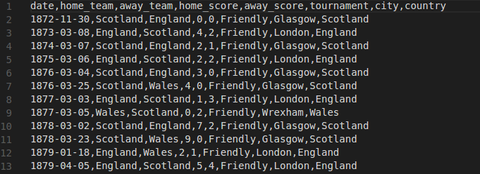

## Data Processing 
This dataset has already contains everything we needed to do the visualization. But this is the reason that this dataset must be processed before using. First, in terms of winning rate for different kinds of games, we need caluclate Win or Lose or Defend based on the score. Second, It will be convenient for us to fist do some classification based on either year, team or country. 

Data processing is mainly done in python. We use pandas to read the csv data and then write the desired data into a js file, which will be included as script tag for the project. So in our project we can easily access to it.

Here is a code snippet for the data process using python. This code generate a JS dictionary which uses year as key, and value is an array of all the team that has games in that year. The generated data is written to a JS file for convenience.

~~~python
def get_teamList_by_year():
    soccer_data = pd.read_csv("data/results.csv")
    with open("teamListByYear.js","w") as out:
        out.write("var teamListByYear = { " + "\n")
        active_year = 0
        count = 0
        team_set = set()
        for date, home_team, away_team in zip(soccer_data['date'], soccer_data['home_team'], soccer_data['away_team']):
            curr_year = date[0:4]
            if curr_year != active_year:
                active_year = curr_year
                team_set = set()
                if count != 0:
                    out.write("], " + "\n")
                out.write(curr_year + ": " + " [ ")
                count += 1
            if home_team not in team_set:
                out.write('\"' + home_team + '\"' + ", ")
                team_set.add(home_team)
            if away_team not in team_set:
                out.write('\"' + away_team + '\"' + ", ")
                team_set.add(away_team)
        out.write("] " + "\n" + "};")
~~~ 

# Design

## Initial Design
Initially, we have two parts, part 1 mainly contains a heatmap showing the number of games in countries, part 2 has force directed graph and a win lose bar as well as pie chart to showing winning rate.

- part1:
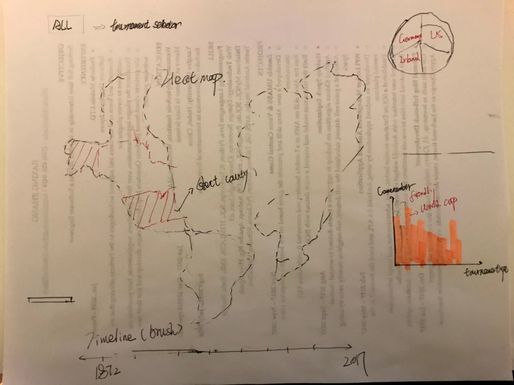
The frist part's prototype was consist by 3 main components, which are one world heatmap, one bubbule chart and one bar chart. User can use the tournament seletor to specify the tournament(default value "all" means all kinds of tournament), and use the timeline to choose time period(default time is from 1870 to 2017). Suppose one user who only cares about Ireland soccer team's performance in friendly campaign from 2012 to 2016. Then s/he can select the time and country by using timeline, clicking on Ireland in the map and choose tournament on the tournament selector. 
Each coutry on the map will has different color, the color indicaties the number of campaign each coutry has played in the selected time period and selected tournament. 
In the default statu (time from 1870 to 2017, and no country has been selected no tournament has been chose), the bubble chart shows the 10 countries in the history who had played more game than others. If user choose any conidtion like clicking on country in the map, or select time period, the bubble chart will interact with user' actions. For instace, it will show the 10 most popular away teams which had played most game with Ireland during 1920 to 1930. 
On the other hand, the bar chart shows the 10 most popular tournaments of the default statu. And it also can interact with user actions. For instance, if user choose Ireland and time period from 1980 to 2017, the bar chart will show the 10 tournaments and the game number of each tournament which Ireland had participated most from 1980 to 2017.

- part2:

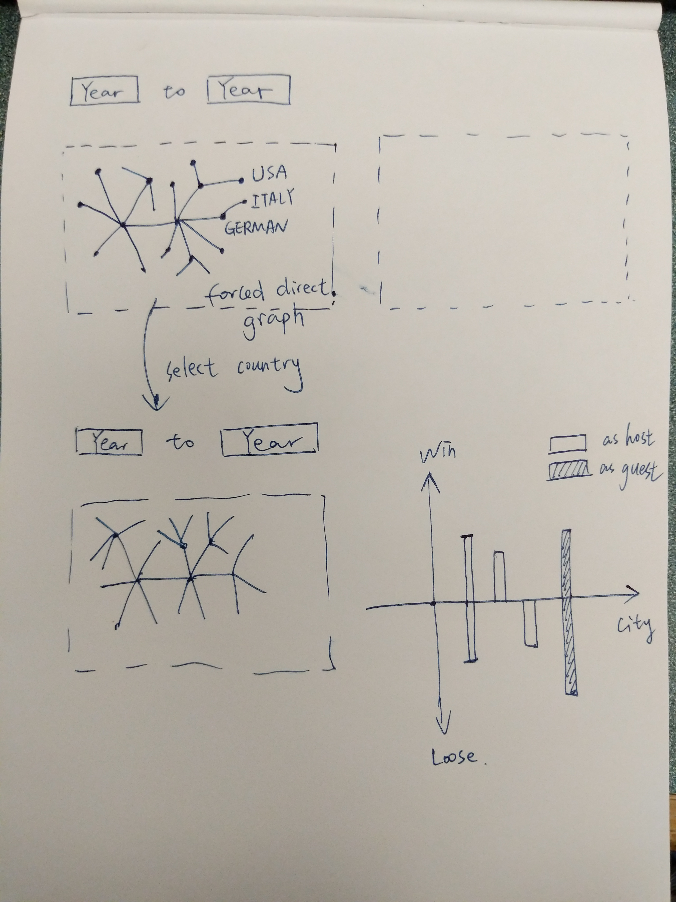

This sketch contains the original design of part 2. What on the left is a force directed graph showing all the games within year period. The node represent teams, if two teams have game with each other, then there will be a link. When clicking in the nodes, right part will appear the win lose bar chart for a team in different cities.

## Final Design
Finally, our design contains three parts. With each part consists of some different chart type.

Total:

Part 1:
In our final design, we decided to discard some elements from the prototype and also added new components to it. Because bubblt chart is not good with showing the differece of volume, we decided not to use it in our final design. Instead, we add two other bar charts in oredr to show detail of the internation soccer campaign history. One is used for showing the top years which has more campagins than other years. One is to show who was the most popular away team during selected time period. Comparing with bubbule chart, bar chart is much better to show the difference, that's why we finally choose use it more than once.
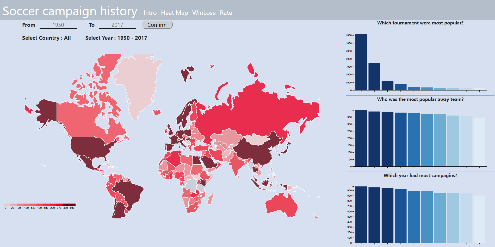
### Heatmap default statu(no time and no country was selected). 
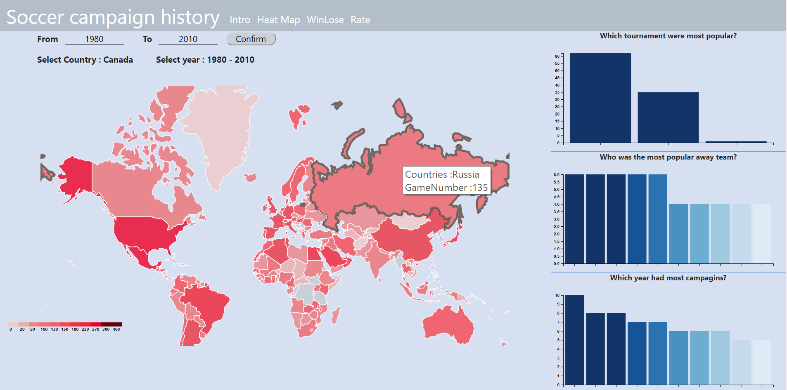
### User choose specific time period and country.
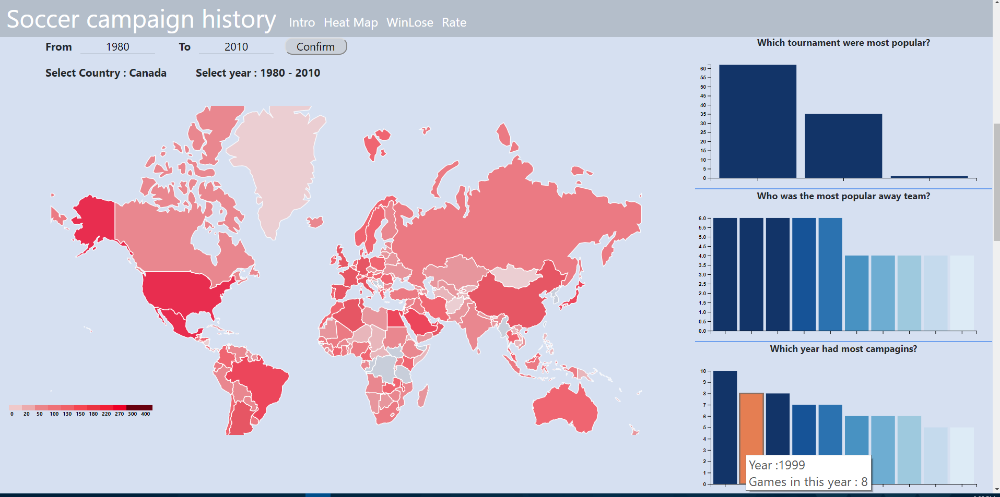
### Mouse hover on element, then title bar will show up to provide information detail. 
- Heat map:In the final design, user could choose the time period by entering years to the time input areas. Default time is from 1950 to 2017. User could enter year between the default time period to the input, but the right input must be lagger than the left input and a window alert will remind user to enter valid input. 
Country will be highlight if the mouse hover or click on it. And when you click on any country or select time period, the indicator above the map will change to indicate your chose. And country color will also change accompany with the changing of time period.  
- Bar chart: The final design bar chart was made of three distinctive bar charts. The first one shows detail of the 10 most popular tournaments, the second charts shows the 10 countries which were the most popular away team and the last one show in which year, the selected coutry has play most campaigns. And all the three charts can also interact with the time selector and country selector.

Part 2:

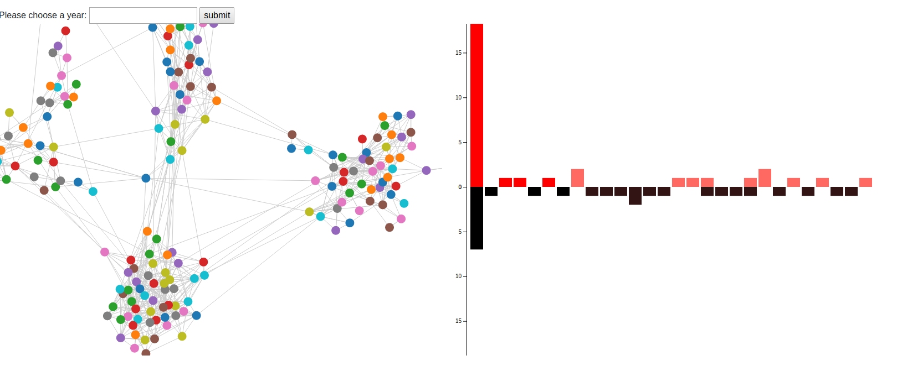
This screenshot shows the final design for the part2. Left part is a force directed graph, and a html submit which you can specify the year. The right part is a bidirectional bar graph showing the number of winning and the number of losing plus defending games for the team in different cities. The force directed graph only shows one years's data, but the win lose bar will show more years from [year-3, year+3], year is what you submit.

- Force directed Graph

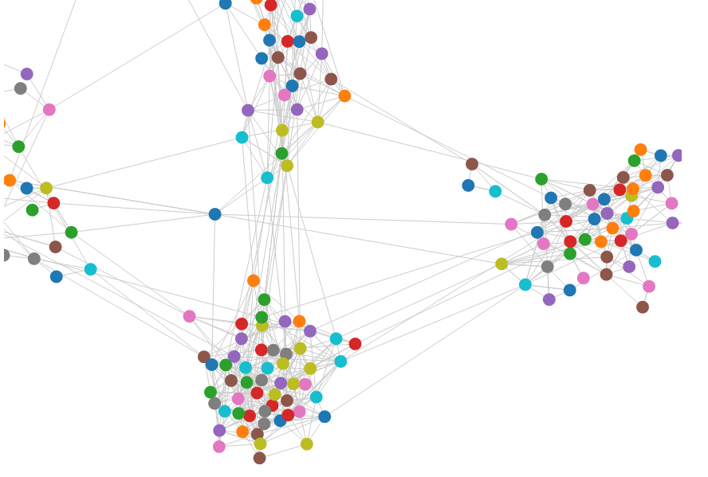

The force directed graph is dragable, means you can drag one node and move it to some place else. Each node will show a tooltip when mose is on showing the team of the node.

- Bar chart

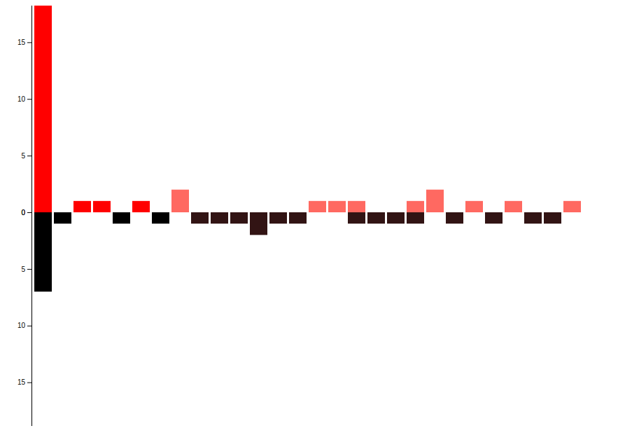

The winning is displayed in red. The losing and defending is displayed in black. However the showing of win or lose as guest or host will be slightly different. The color for guest win will be more like pink to show a slightly difference.

Part 3:

The third part of this project aims to show the winning rate of a country in a continuous time perid using slope chart. So that, we can see whether a country's performance is stable or it encontered a downturn. The following screenshots shows the components of the winning rate page. The interactive events are clearly show in the project video.

- Country Selection

This is the left part of the page. We can type in and click "Add" buttom to add a new country. If we don't want to show certain country's data, just drag it's label out to delete it.

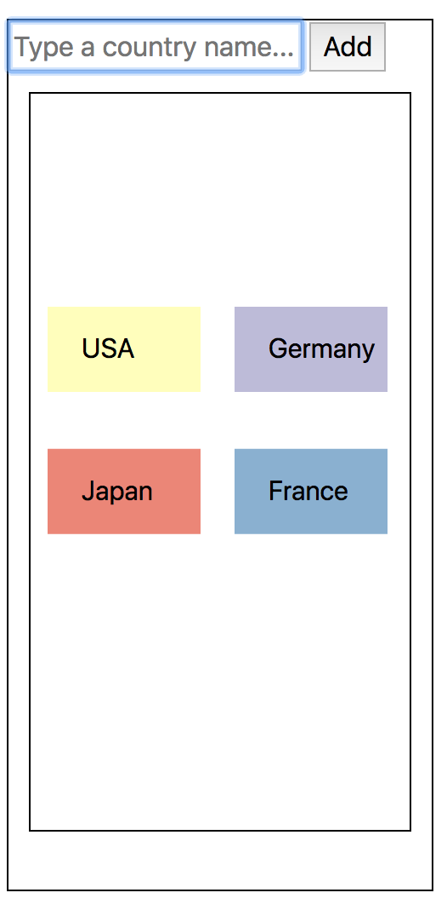

- Winning Rate Slope Chart

This is the middle part of the page. We present the winning rate of the selected countries in a continuous five years. Clicking the buttoms beside can change the time period. Lines will be lightened when mouse over.
      
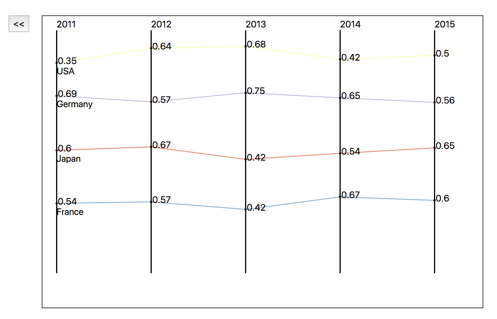

- Pie Chart

When click certain line in the slope chart, a pie chart will be presented in the right part of the page. The pie chart shows the detailed tournaments the country attened in that year.
      
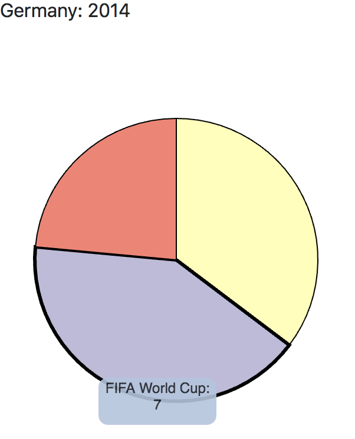

# Implementation

- Force Directed Graph

 Implementing the force directed graph mainly have reference from the book interactive data visualization chapter 13. In order to draw the graph, we have to prepare the data, nodes indicating countries, links indicating matches between countries. The data preparation stage is done part by python, and partly done using d3.

 The python part gives me two JS dictionary with key being the year, and the value is a list of results for different games and another dictionary with key being the year, value being the team list for that year. In D3 part, I use forEach to loop through the dctionary. Add countries to nodes, and check if two countries have matches in this year, and add them to links. This prepares the data needed for the force directed graph. The rest is simple using d3.force.

 - Win Los Bar chart

This Win los bar contains two y axis, so it will show data in two directions. Each bar chart has the same x value, so no need to use two x axis. Both Force directed graph and win lose bar has mouse hover showing a tooltip of details.

- Country Selection Field

From the pre-processed data, we get the list of all countries. When type a country's name in the text box and click buttom, we will check the country list to make sure it's a leagal input. Then draw a new label in the field and update the selected country list for further update. When drag the label, we will check whether the label has been dragged out based on the event position. If so, update the selected country list and reallocate the remained labels.

- Slope Chart

The slope chart is composed of lines which use d3.path, data points and axis. Changing  the country selection field or time window will both trigger the chart update. Country's change causes the update of lines and data points. Time's change causes the update of lines, data points and axis using click event.

- Tournament Pie Chart

Update of this part is trigger by the click event of slope chart. Use mouse hover and tooltips to show the detailed tornament name and match number.

# Conclusion

- In this project we present the international football result dataset in different dimension using different kinds of charts. The world heatmap shows the popularity of football around the world. The force directed graph shows the frequent communication between countries via football match. The slope chart shows the change of different countries' perfomance.
- Many tools, libraries and technologies are used in our project, including bootstrap, different kinds of  event and tooltips. Since we want to develop a page which is highly interactive.
- Through this project, we want to present the history and great influence of football, as well as the enthusiasm of football fans from different countries.
