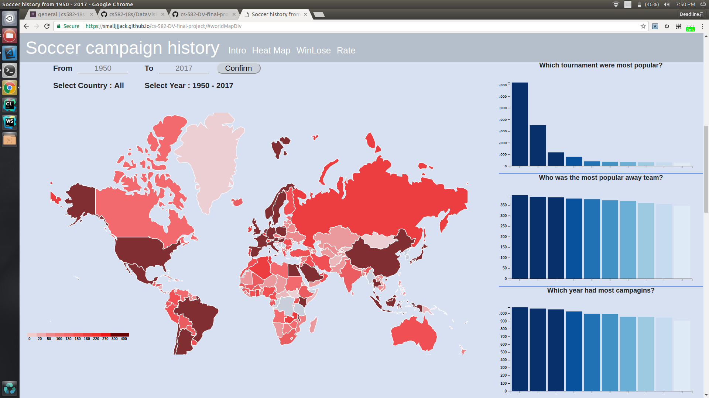
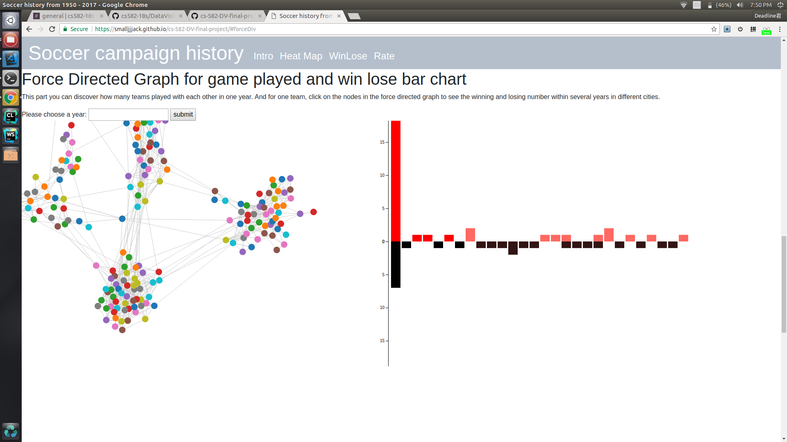
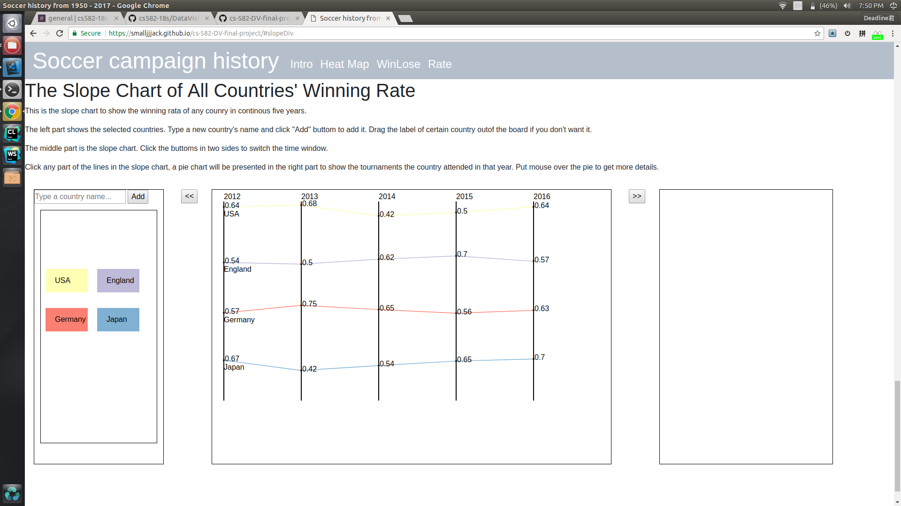

# cs-582-DV-final-project

- Github repo: https://github.com/smalljjjack/cs-582-DV-final-project
- Github page: https://smalljjjack.github.io/cs-582-DV-final-project/
- Demo video: https://www.youtube.com/watch?v=wuuvKgQFtew&feature=youtu.be
- Process book: https://github.com/smalljjjack/cs-582-DV-final-project/blob/master/ProcessBook/ProcessBook.md

Teammember:
===

Jiaxing Zhang, Xuanyu Chen, Zetian Wang

Overview
===

This Soccer Data Vis contains three parts, there over view are shown below:

Fist part is a world map showing with color indicating how many games that a country played in the year period of your choice. You can also click it, three bar chart will show game number for different types.

Second part is a force directed graph and a bi-directional bar chart. Nodes in the force directed graph means a country, and link between nodes indicates that there two countries had match in this year. You can choose year by typing and submit. The bar chart shows the number of winning and losing for different teams in different cities. 

Third part is a slope chart showing the winning rate for different teams. You can choose team, and choose year.

